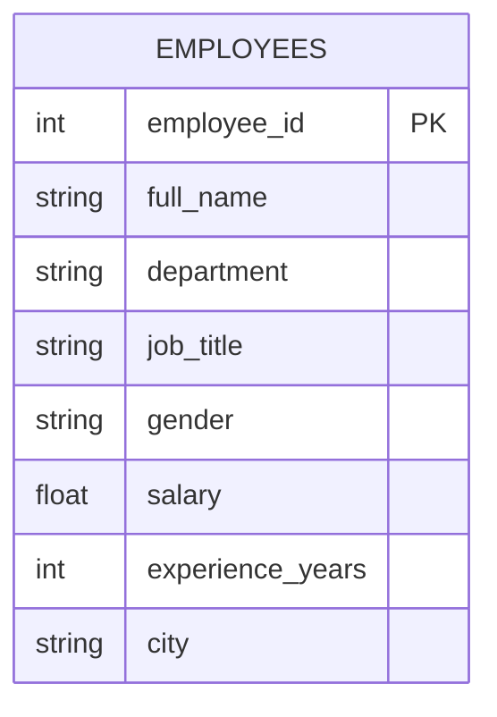

# Employee Database Cleaning
> *Analyzed an employee database using Microsoft Excel to clean, transform, and explore workforce data. The project focuses on data preparation, text manipulation, and aggregation techniques to generate insights on employee distribution, salaries, and departmental performance.*

---

## ⚙️ Project Type Flags

- [ ] Exploratory Data Analysis (EDA)
- [ ] Data Cleaning / Wrangling

---

## Table of Contents
1. [Project Overview](#1-project-overview)
2. [Objectives](#2-objectives)
3. [Project Scope & Tools](#3-project-scope--tools)
4. [Repository Structure](#4-repository-structure)
5. [Data Workflow](#5-data-workflow)
6. [Data Model & Schema](#6-data-model--schema)
7. [ERD - Entity Relationship Diagram](#7-erd---entity-relationship-diagram) 
8. [Analysis & Metrics](#8-analysis--metrics)
9. [Key Insights](#9-key-insights)
10. [Recommendations](#10-recommendations)
11. [Assumptions & Limitations](#11-assumptions--limitations)
12. [Future Enhancements](#12-future-enhancements)
13. [Deliverables](#13-deliverables)
14. [Author](#14-author)

---

## 1. Project Overview

<!--
  Write 3–5 sentences in plain language.
  Cover: context → problem → approach → outcome.
  Read it out loud. If it sounds like a form - rewrite it.

  WHAT GOOD LOOKS LIKE:
  "A mid-size retail business was seeing inconsistent revenue across
  its regional stores but couldn't identify the root cause. This project
  explored 18 months of transaction data across five regions to determine
  whether underperformance was driven by sales volume, pricing, or return
  rates. The analysis revealed that one region's gap was almost entirely
  explained by an unusually high return rate on a single product category -
  a finding invisible in the company's top-level reporting."

  WHAT TO AVOID:
  "This project analyzes sales data to find trends and insights."
  (Too vague. Could describe 10,000 projects. Describes none of them.)
-->

Organizations generate large amounts of employee data including salaries, roles, experience levels, and departmental structures. Without proper analysis, this information remains underutilized for decision-making.

This project analyzes a structured employee database using Microsoft Excel. The dataset contains fields such as employee ID, full name, department, job title, salary, experience level, gender, and city.

The analysis focuses on cleaning and preparing raw data, applying Excel text functions, and performing aggregate calculations to generate insights about workforce distribution and salary patterns.

The outcome demonstrates how Excel can be used as a practical tool for HR analytics and workforce insights.

---

## 2. Objectives

<!--
  Write objectives that are specific enough to succeed or fail.
  Use action-oriented verbs: Identify, Determine, Quantify, Build, Evaluate.

  WHAT GOOD LOOKS LIKE:
  ✅ "Determine whether customer churn rate correlates with support ticket volume."
  ✅ "Identify the top three revenue-driving product categories across all regions."
  ✅ "Build a reproducible pipeline that ingests and cleans daily sales exports."

  WHAT TO AVOID:
  ❌ "Explore the data."
  ❌ "Gain insights."
  ❌ "Understand trends."
  (These can't fail - which means they can't succeed either.)
-->

- **Primary Objective:** Prepare and clean employee data so it can be reliably used for analysis and reporting.
- **Secondary Objective 1:**
- Remove duplicate rows and invalid entries
- Standardize employee information such as city names and text formatting
- Extract meaningful fields from raw text data (first name, last name)
- Generate employee email addresses using Excel functions
- Perform salary analysis using Excel aggregation functions
- Calculate department-specific metrics for HR insights

> 💡 *Every analysis decision in this project traces back to one of these objectives.*

---

## 3. Project Scope & Tools

### Scope

<!--
  WHAT GOOD LOOKS LIKE:
  In Scope: "Transaction-level data for Regions A–E, Jan 2023–Jun 2024.
             Analysis covers revenue, return rates, and product category performance."
  Out of Scope: "Customer demographics and marketing spend data were excluded -
                 demographic data was incomplete for two regions, and marketing
                 data sits in a separate system outside this engagement."

  WHAT TO AVOID:
  ❌ Leaving Out of Scope blank. This is the section that protects your credibility.
     If you don't define the fence, reviewers assume you missed things.
-->

| Dimension | Details |
|-----------|---------|
| **Dataset** | Employee database |
| **Records** | 100 employees |
| **Fields** | Employee ID, Full Name, Department, Job Title, Gender, Salary, Experience, City |
| **Analysis Focus** | Data cleaning, text manipulation, salary analysis |
| **Granularity** | Employee-level |

### Out of Scope
- Performance reviews
- Recruitment data
- External HR benchmarking data

### Tools & Technologies

<!--
  List only what you actually used on this project.
  This is not your skills section - it's the project's technical context.
-->

| Category | Tool(s) Used |
|----------|-------------|
| Data Analysis | Microsoft Excel |
| Data Cleaning | Excel functions |
| Text Processing | Excel Text Functions |
| Aggregations | SUM, AVERAGE, COUNTA, SUMIF, AVERAGEIF |
| Documentation | Markdown |

---

## 4. Repository Structure

```
Employee-Database-Analysis/
│
├── data/
│   └── employee_database.xlsx
│
├── analysis/
│   └── excel_analysis.xlsx
│
├── reports/
│   └── employee_analysis_report.md
│
└── README.md

```

## 5. Data Workflow

```
Raw Employee Dataset
        ↓
Data Cleaning
(Remove duplicates, trim spaces, standardize text)
        ↓
Text Transformation
(Extract names, generate emails)
        ↓
Aggregation Analysis
(Salary totals, department averages)
        ↓
Insight Generation

```

### Data Cleaning Steps
- Checked for duplicate employee records
- Trimmed extra spaces in text fields
- Standardized casing in departments
- Verified numeric fields for salary and experience
- Ensured consistent city naming
  
---

## 6. Data Model & Schema

<!--
  Define your fields so that someone reading your analysis can follow along
  without digging through your code.

  WHAT GOOD LOOKS LIKE (one row example):
  | transaction_id | string | Unique identifier per sales transaction | TXN-00482 |
  | return_flag    | boolean | Whether the transaction included a return | TRUE |
  | region_code    | string | Two-letter identifier for store region | "NE" |

  WHAT TO AVOID:
  ❌ Skipping this section because "the field names are self-explanatory."
     They're not. Not to a reviewer. Not to you in six months.

  📌 FOR SQL PROJECTS: If you have multiple tables, create one block per table.
     Describe join keys and relationships here. Your ERD (Section 7) will
     visualise what this section describes in text.

  📌 FOR NON-SQL PROJECTS: Describe the shape of your dataset informally
     if a formal schema doesn't apply. Even one paragraph is more helpful than nothing.
-->

### Dataset: `Sales Data`

| Field Name | Data Type | Description | Example Value |
|------------|-----------|-------------|---------------|
| `Employee ID` | Integer | Unique employee identifier | 1001 |
| `Full Name` | String | Employee full name | Sade Bassey |
| `Department` | String | Department employee belongs to | HR |
| `Job Title` | string | Employee role | Recruiter |
| `Gender` | String | Employee gender | Female |
| `Salary` | Currency | Monthly salary | $350,000 |
| `Experience (Years)` | Integer | Years of experience | 5 |
| `City` | String | Employee location | Lagos |

---

## 7. ERD - Entity Relationship Diagram

### Mermaid Diagram 


---

## 8. Analysis & Metrics

<!--
  Explain what you measured and how - before you share what you found.

  WHAT GOOD LOOKS LIKE:
  Metric: "Customer Return Rate"
  Definition: "Number of transactions flagged as returns divided by total
               transactions, calculated at product-category and regional grain."
  Why It Matters: "Return rate - not sales volume - was hypothesised to
                  explain regional revenue gaps. This metric tests that hypothesis."

  WHAT TO AVOID:
  ❌ Defining a metric only in code: SUM(returns) / COUNT(transaction_id)
     That's an implementation. Write the plain-language definition here.
     Both belong in your project - the definition in the README,
     the implementation in the code.
-->

### Analytical Approach

The analysis applied Excel functions to clean text, transform fields, and calculate salary statistics across departments.

### Key Excel Functions Used

| Function | Purpose |
|--------|--------------------------|
| `TRIM()` | Remove extra spaces |
| `UPPER()` | Convert text to uppercase |
| `LOWER()` | Convert text to lowercase |
| `PROPER()` | Convert text to proper case |
| `LEN()` | Measure text length |
| `SUM()` | Calculate total salary |
| `AVERAGE()` | Calculate average salary |
| `SUMIF()` | Department-specific totals |
| `AVERAGEIF()` | Department-specific averages |

---

###  Key Metrics  

| Metric | Definition | Why It Matters |
|--------|--------------------------|----------------|
| `Total Salary` | Sum of all employee salaries | $34,862,380 |
| `Average Salary` | Average salary across employees | $348,624 |
| `Total Employees` | Number of employees in dataset | 100 |
| `Sales Department Salary` | Total salary for sales department | $6,348,960 |
| `HR Department Average Salary` | Average salary in HR department | $362,518 |

---

## 9. Key Insights

<!--
  Findings + implications. Not just what happened - what it means.

  WHAT GOOD LOOKS LIKE:
  ✅ "Return rates, not sales volume, explain Region A's underperformance.
      Region A's return rate on home goods was 34% - more than double the
      company average. Revenue was not lost at the point of sale; it was
      lost post-sale through refunds. This points to a fulfilment or
      product quality issue specific to that region, not a demand problem."

  WHAT TO AVOID:
  ❌ "Region A had lower revenue than other regions in Q4."
     (That's an observation. It describes what happened.
      An insight says what it means and where to look next.)

  Aim for 3–6 insights. Quality over quantity.
-->

**Insight 1: Workforce Salary Distribution**

The dataset contains 100 employees with an average salary of $348,624, indicating a mid-to-senior level workforce structure.

**Insight 2: Departmental Salary Variation**

Different departments show variations in salary totals, with the Sales department accounting for a significant share of payroll spending.

**Insight 3: Structured Workforce Data**

The dataset is highly structured with consistent formatting in most fields, indicating good internal data management.

This suggests improving sales performance and potential continued growth in Q2.

**Insight 5: High-income customers drive profitability**

High-income customers account for approximately 54% of total profit, making them the most valuable customer segment.

---

## 10. Recommendations

<!--
  Action-oriented. Addressed to a real audience.
  Tied explicitly to the insight that supports each one.

  WHAT GOOD LOOKS LIKE:
  Priority: High
  Recommendation: "Conduct a fulfilment audit for home goods deliveries
                   in Region A - specifically investigating whether returns
                   correlate with a particular warehouse, carrier, or SKU batch."
  Based On: Insight 1 - return rate anomaly in Region A
  Owner: Operations / Supply Chain team

  WHAT TO AVOID:
  ❌ "Improve the return rate."
     (Not actionable. Doesn't say who, how, or where to start.)
  ❌ "Further analysis is needed."
     (This is a placeholder, not a recommendation.)
-->

| Priority | Recommendation | Reason |
|----------|---------------|----------|
| High | Maintain standardized data entry practices | Prevent inconsistent records |
| Medium | Automate HR reporting using Excel dashboards | Improve decision-making speed |
| Medium | Track department salary trends regularly | Monitor payroll distribution |
| Low | Integrate employee performance data | Enable deeper workforce analysis |

---

## 11. Assumptions & Limitations

<!--
  WHAT GOOD LOOKS LIKE:
  Assumption: "Sales data represents all transactions for the period.
               Product costs remained stable during the analysis period."
  Limitation: "Marketing spend data was not included
               May 2025 data is partial and not directly comparable to full months.
               Customer demographic data was unavailable"

  WHAT TO AVOID:
  ❌ Leaving this section blank or writing "None known."
     Every project has limitations. Documenting them is a sign of
     analytical maturity - not a confession of failure.
-->

### Assumptions
- Employee records represent the full workforce dataset
- Salary values are accurate and consistent
- Experience values are reported correctly

### Limitations
- Dataset size limited to 100 employees
- No performance or productivity data available
- No historical salary trends included

---

## 12. Future Enhancements

<!--
  WHAT GOOD LOOKS LIKE:
  ✅ "Automate the monthly data pull from the POS export folder using
      a scheduled Python script, replacing the current manual process."
  ✅ "Expand the return rate analysis to include carrier-level data,
      which was unavailable in this dataset but exists in the logistics system."

  WHAT TO AVOID:
  ❌ "Add a machine learning model."
     (Vague, and disconnected from the actual findings of this project.)
  ❌ Listing aspirational features that don't follow logically from the work.
-->

- [ ] Add multi-year sales data to enable long-term trend analysis
- [ ] Incorporate marketing campaign data to measure ROI
- [ ] Build predictive sales forecasting using machine learning
- [ ] Build predictive sales forecasting using machine learning

---

## 13. Deliverables

| Deliverable | Description |
|-------------|-------------|
| Excel Analysis File | Cleaned and analyzed employee dataset |
| Excel Formulas | Implemented text and aggregation functions | 
| Project Documentation | README describing analysis workflow | 

---

## 14. Author

**Faith Adedolapo**

Data Analyst | Business Analyst

- 🔗 [LinkedIn URL](https://www.linkedin.com/in/faithadedolapoolayiwola)
- 💼 [Portfolio or GitHub profile URL](https://faithadedolapo.github.io/)
- 📧 [Email](olayiwolaadefaith@gmail.com)

---

*Last updated: March 2026


